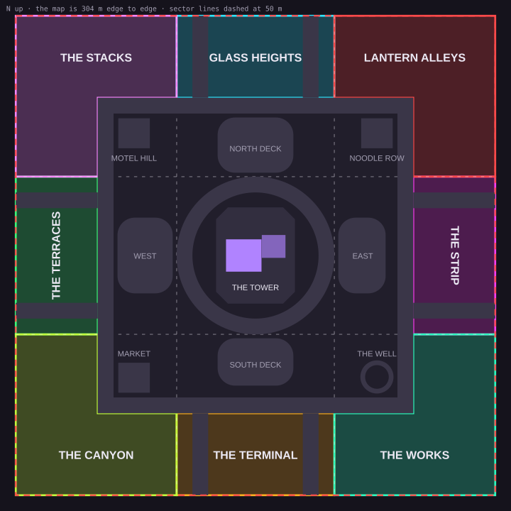

# Phase 29 and 30 plan: finish the centre, then the eight districts

A plan, nothing built from it yet: for the owner's go-ahead first. What is left in the Neon City's centre, the middle
building first, and the eight districts round it, every one of them built from the **Daelonik Neon City bundle alone**:
no ILranch piece anywhere (the owner, 2026-10-07: "make sure we aren't using the cheap $5 assets, only the neon city
bundle stuff", "I don't want ANY ILranch stuff in there"). The centre uses 134 of the bundle's 1,826 pieces, so the other
1,692 are enough to make each district look like nothing else on the map.

The same plan with pictures of every family's pieces, cut from the contact sheets made when each piece was measured:
the claude.ai artifact "Neon City Master Plan" (https://claude.ai/artifact/5wHZKfRp81SC5qg9eUcF9j). The pictures are
renders of the paid models, so they stay out of git.

| | |
|---|---|
| Live map | version 46 (Milestone 480, 2026-10-04) |
| Placements in the centre | 4,560 |
| Neon pieces used so far | 134 of 1,826 |
| Fresh review, round 4 | 5 of 10 (docs/CENTRE_REVIEW.md) |
| Map | 304 m edge to edge, 30 players |

## The whole map, to scale

The centre fills the middle 200 m and holds all nine battle royale sectors today: THE TOWER, the four High City decks
and the four corner blocks, split at ±50 m and running out to the edge. Past the ring road (90 to 100 m out) is a band
52 m deep to the map's edge at 152 m, plain floor since the cut to 304 m (Phase 23.3: "focused in the middle"). This
plan puts one district in each sector's share of that band, so a sector is its centre block and its district together:
one name family, one light colour, decayed together. Each edge district is 100 × 52 m (5,200 m²), each corner an L of
about 7,900 m²; all eight together 52,400 m², a third more ground than the centre's 40,000 m². The straight roads at
±35 m go on through them to the edge: the outer districts keep straight roads, against the centre's curves (the owner,
Milestone 360).

## The Neon bundle, bucketed into families

The bundle's unused pieces fall into families that each have their own architecture. Each district takes one family as
its own, and no two neighbours share one. Counts are the pieces in the family and how many the centre already uses
(`speedkills-paid/neon/catalogue.json`, against the map's placements).

| Family | Pieces | Used | What it is | Goes to |
|---|---:|---:|---|---|
| Capsule towers | 25 | 0 | towers of stacked boxes 42 to 111 m (Neon Buildings 01, 02, 09, 10, the decorative stacked towers), the capsule floor kit and capsule rooms | THE STACKS |
| Shophouses and pyramid roofs | 120 | 7 | shophouses 10 to 18 m with balconies and AC units, shop-front floor kits, pyramid roofs, the shrine yard, 26 cables, 39 graffiti | LANTERN ALLEYS |
| Rust and machinery | 68 | 3 | the rusted metal floor kit, pipes, beam frames, cooling boxes, roof tanks, the tank-topped block | THE WORKS |
| Sleek white and glass | 132 | 1 | office slabs with glass crowns, slim towers to 72 m, lift floors, canopied white walls, exterior gates, glass fences, elevators | GLASS HEIGHTS |
| Walkway streets | 242 | 0 | raised walkway decks over shop fronts, street platforms with fronts rising 50 m, gangways, crossroads, escalators | THE CANYON |
| Glow and signs | 113 | 25 | glowing blocks and pyramids, towers with lit bases, holo and street ads, luminaries, lights | THE STRIP |
| Balcony blocks and roof decks | 82 | 1 | balconied floor kits, timber-slat fronts, railed rooftop decks, stair huts, roof edges | THE TERRACES |
| Stations and trains | 173 | 29 | stations, metro stairs and corridors, wagons, rail tiles, urban trains, signs | THE TERMINAL, the −24 m line |
| Rooms | 175 | 15 | capsule, chamfered, hexagonal, square and corridor rooms, lift rooms, furniture, items, tech | every district's insides |
| Skyline | | | giant lit monoliths 206 to 262 m, a 233 m tower, whole stacked towers | past the edge, as the backdrop |

Shared by all: about 700 more pieces of interior walls and floors, street kit, building deco and basic shapes, and the
street furniture, lamps and cars the centre already uses, so the ground reads as one city from district to district.

**The bundle's own scenes, which is what makes it plug and play.** NeonScene00 is a dense alley street (1,990
placements: cable webs, pipes, shophouses); NeonScene01 terraced gardens (979: city walls, planters, grass, raised
ground); NeonScene02 a street of 132 parked and flying cars round a building; NeonBuildings00 a street of composed
buildings (3,166). Where a scene fits a district, that district is cut in from it, as Phase 25 cut a corner in from its
pack's scene; elsewhere it is composed from the family's whole premade buildings, the way the centre was.

## The eight districts

Each continues the centre block beside it, takes a family nobody next to it uses, has one landmark seen from the centre
in its own colour, one space no other district has, and loot of its own. The rules from round 4 apply from the first
build: cover within 6 m on every street, a way up every building that is not a pad, every edge railed, every building
sealed.

| District | Where | Family | Landmark | Only here |
|---|---|---|---|---|
| **THE STACKS** | north-west, MOTEL HILL's sector, pink | capsule towers | the twin capsule towers (60 m) | capsule rooms you walk through, pod by pod, up the stack: a capsule hotel beside the MOTEL |
| **LANTERN ALLEYS** | north-east, NOODLE ROW's sector, red | shophouses; cut in from NeonScene00 | the shrine yard with its bare tree, strung with red lanterns | dozens of small shops, each its own room; low roofs a sprint jump apart |
| **THE STRIP** | east, EAST DECK's sector, magenta | glow and signs | the tower on its glowing lantern base (87 m) | a club under an inverted glowing pyramid, a balcony ring and a bar; the map's loudest light kept here |
| **THE WORKS** | south-east, THE WELL's sector, teal | rust and machinery | a block crowned with tanks, venting steam | the one district you cross indoors: halls joined to THE WELL's lowest gallery and the metro tunnel |
| **THE TERMINAL** | south, SOUTH DECK's sector, amber | stations and trains; NeonScene02's cars on its forecourt | the station's vaulted roof | the deep line at −24 m comes up here; wagons you walk through as cover |
| **THE CANYON** | south-west, MARKET's sector, yellow-green | walkway streets | a gangway arch high across the canyon | three streets stacked: the market floor, the walkway decks, the gangways across |
| **THE TERRACES** | west, WEST DECK's sector, green | balcony blocks and roof decks; gardens from NeonScene01 | the stepped gardens | the roof-deck layer at 10 to 18 m, the map's roof-hopping run; flats you walk through |
| **GLASS HEIGHTS** | north, NORTH DECK's sector, cyan | sleek white and glass | the office tower with the cyan glass crown (64 m) | a lobby atrium with a lift, and a gangway from the North deck to its tower |

Ways up and loot, by district: THE STACKS by the towers' stairs and balconies, loot richer the higher; LANTERN ALLEYS by
exterior stairs and fire escapes onto 10 to 18 m roofs, one or two items a shop; THE STRIP by the club's balcony stairs,
loot in the club; THE WORKS by catwalks on the beam frames, loot in the machine hall's core; THE TERMINAL by the station
stairs, loot in the ticket hall and the wagons; THE CANYON by escalators and stairs to the decks, loot in the shops and
on the gangways; THE TERRACES by balconies and stair huts, loot in the flats and on the decks; GLASS HEIGHTS by the lift
and the atrium stairs, loot on the executive floor.

## What is left in the centre

From the inventory of what is built, the fourth review's asks and the gaps found measuring the bake. The middle building
first.

### The middle building

1. **Framed doorways and floor numbers on black** (Milestone 484, built). Every doorway on the rooms and maze floors in
   the pack's steel door frame, the halls' gates too, sunk to show their heads under the 2.5 m ceilings. Every door
   measured open 1.2 to 1.5 m, the floors 98 to 99% walked.
2. **The sky floors at 38.5, 42 and 45.5 m** (Milestone 503, built). The 45.5 m storey had no ceiling, the tower's
   hollow upper half open over it: closed by a lid at 48.5 m. Each numbered (9 to 11, the pack's signs two side by side
   for 10 and 11, 2 m high, the storeys being too low for 3 m), in its own panels, and laid out to a plan none of the
   floors under it use: a loop, two halves, corner bunkers. Their floors are still the pack's own tiles.
3. **THE VAULT reads from outside** (Milestone 504, built in part). Its window row framed in gold from the slab's
   edge to the sills and from the windows' tops to the next sills, its lamps gold. Its name in lights on each face is
   left: the pack has no letter set, so it needs the map to draw words of its own. The loot's glow is item 11's.
4. **The empty upper half, 47.5 to 108 m** (built, Milestone 509: the stair carried on to the crown, three levels at
   60.5, 75.5 and 90.5 m, two express ropes from the 45.5 m floor to the penthouse). Measured off the bake: above the sky floors the tower is a hollow
   shell for 60 m, with no floors, no stairs and no windows that open; the crown at 109 m is reached only by pad from
   outside. Proposal: the pack's elevator as an express lift from the lobby to three new levels (a sky lobby at about
   60 m with the long shots over the city, a machine hall at about 75 m in the rust family's metal, a penthouse at about
   90 m with lounges and bars), then stairs up into the crown: the tower climbable from inside, bottom to top.
5. **The lookout and the ways between the tower and the decks** (Milestone 505, built in part). Zip lines from the
   lookout to the north, east and south decks, built. Cover on the bridge ring, built (Milestone 506). Left: a canopy and a
   third crate on the 49 m lookout; one gangway from a deck to the tower's 26 m windows (planned in Milestone 354, never built).
6. **The deep station at −24 m**, with THE TERMINAL: the pack's underground demo has a second station there with two
   lines and a square shaft through every level.

### The rest of the centre

7. **High City:** a crown and a street-facing sign on each block (the colours are built, Milestone 474); the pack's
   exterior stairs and fire escape up the south and east blocks' flat faces, where balconies do not fit their round
   lobes.
8. **The corner blocks:** a roof-hopping layer at 8 to 15 m from the railed roof decks, a pad up on every block, cover on
   the roofs; a big neon front on THE WELL and on MARKET, which round 4 still could not tell apart; their sector colours
   fixed (THE WELL's is violet against a teal beam, MARKET's blue against a green one).
9. **Street pieces that look right:** the tall poster boards are posters hanging in the air, solid from the ground, so
   they become the pack's holo ads on stands; the planters' fronds collide as solid; the ad screens still drawing blank
   white get their pictures; walk-in doors framed with the pack's exterior gates.
10. **Light:** a real night (today "a purple-tinted day", the range's sky fill still lighting the city), and noon on the
    ground (too dark, the parked cars glaring).
11. **Loot you can see:** game code (the loot's glow), so a hand-off to the lobby agent, the map giving light at each
    loot spot.

## Where Hyper Scape went wrong, and what each district does about it

| What went wrong | Our rule | Where |
|---|---|---|
| "Much of the map looked alike"; districts "hard to navigate" | every district a different family and architecture, its colour on its lamps, signs and beam, a landmark seen from the centre, a name to call out | all eight; no two neighbours share a family |
| fights lived on the roofs: "any floor lower than a rooftop might as well be lava" (PC Gamer) | cover within 6 m on every street; loot in street-level rooms and on middle floors; a middle layer in most districts | walkway decks, roof decks, pods, the club balcony |
| a tenth of buildings had interiors, all "the same non-decorated rooms" | one interior no other district has, from the room modules, furnished | pods, shops, a club, machine halls, a station, market shops, flats, an atrium |
| a map too big for its players; empty lobbies | 304 m for 30, bots fill every match, one block of district round a dense centre, the decay pulling in | the size stays (Phase 23.3) |
| (our own risk) neon everywhere makes enemies hard to pick out | the loudest light kept to THE STRIP and the centre; THE WORKS, THE TERRACES and GLASS HEIGHTS calmer | THE STRIP against its neighbours |
| (what it did well, kept) every roof reachable, facades climbed in steps, a busy landmark against quieter edges | a way up every building that is not a pad; the centre the busiest, the districts quieter, with fast ways back in | the deep line, zip lines, the gangway, pads at district edges |

## Build order

**Phase 29, finish the centre:** Milestone 484 (the framed doorways); the sky floors themed, numbered and sealed, eleven
floor plans none alike, 3 m numbers; THE VAULT from outside; the street pieces (holo ads, blank screens, planters, door
frames); High City crowns, signs and climbs; the corner blocks' roof layer and THE WELL and MARKET fronts; the lookout,
its zip lines, the bridges' cover and a gangway to the tower; night and noon; the tower's upper half, if approved; then
round 5 of the fresh review from the same 24 spots, aiming past 6.

**Phase 30, the eight districts, one at a time.** For each: study its family and scene, its own section in the plan for
a go-ahead, then build, check, photograph and ship. Those with an artist's scene or whole premade buildings first, being
the quickest to look finished: LANTERN ALLEYS (from NeonScene00), THE TERRACES (NeonScene01's gardens and the balcony
blocks), THE STACKS, THE STRIP, GLASS HEIGHTS with the gangway from the North deck, THE CANYON, THE WORKS with its halls
joined to THE WELL, THE TERMINAL with the deep line; then the skyline past the edge, and a fresh review of the whole map.

**Each district's budget:** its own baked file a size; up to about 350k triangles and 80 draw calls once merged by
material; the street bench within 10% of today's after each one. **Its checks:** walked by the player simulator, sealed
by rays, cover within 6 m on its streets, a non-pad way onto every roof, the street graph whole, three photo spots added
to the review set.

## Decisions for the owner

*Answered 2026-10-09: the owner took the recommendations ("make your best assumptions and go for it"), the tower's
upper half with express lifts and three levels "with multiple ways to get up"; and the old ILranch city is taken out
completely, the maps two very basic Neon 1v1 arenas, THE CENTRE and the Neon City (Milestone 507 on). The two
arenas are NEON YARD and NEON HALL (Milestone 508).*

1. **District edges on the sector lines.** Recommended: on the decay sectors' ±50 m lines, so a sector is its centre
   block and its district, one colour, decayed together. Otherwise the old straight roads at ±35 m as the edges, which
   would need the sectors re-cut.
2. **The map stays 304 m.** Recommended: keep Phase 23.3's size and the 52 m band; growing the map would mean more ground
   than 30 players fill.
3. **The family for each district,** as laid out above; any two can swap (THE STACKS and GLASS HEIGHTS, or THE CANYON
   and THE TERRACES).
4. **The bundle's own scenes where they fit.** Recommended: LANTERN ALLEYS cut in from NeonScene00 and THE TERRACES'
   gardens from NeonScene01; the others composed from their families' whole premade buildings.
5. **The tower's upper half.** Recommended: build it, an express lift and three levels to the crown, so the tower is
   climbable inside from the metro at −10 m to 109 m. Otherwise seal the 60 m shell and keep the crown a pad-only perch.
6. **The deep line.** Recommended: build it with THE TERMINAL, the fast covered way between the south and the centre.

Sources: the bake's own placements and collision (map version 46 and the version 47 work in hand), the Neon bundle's
catalogue and contact sheets, its demo scenes, docs/CENTRE_REVIEW.md rounds 1 to 4, the Phase 18 to 28 plans, and the
owner's words quoted in them.
